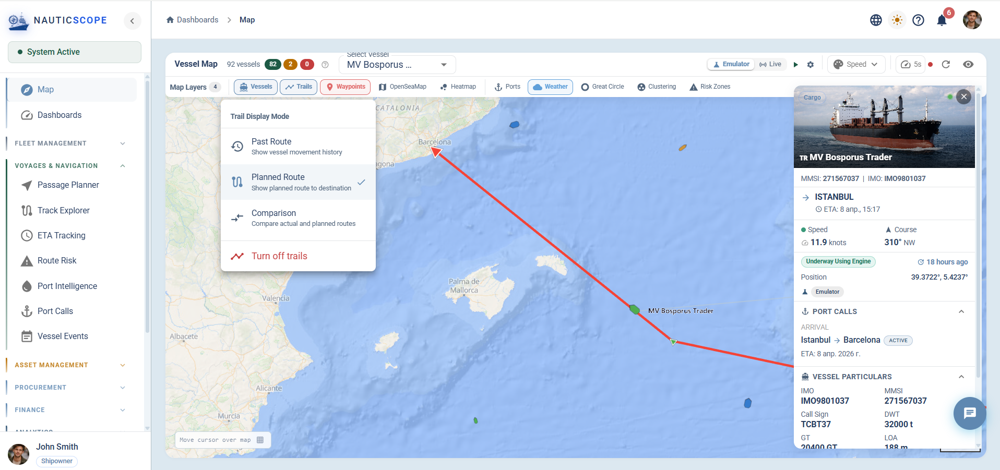
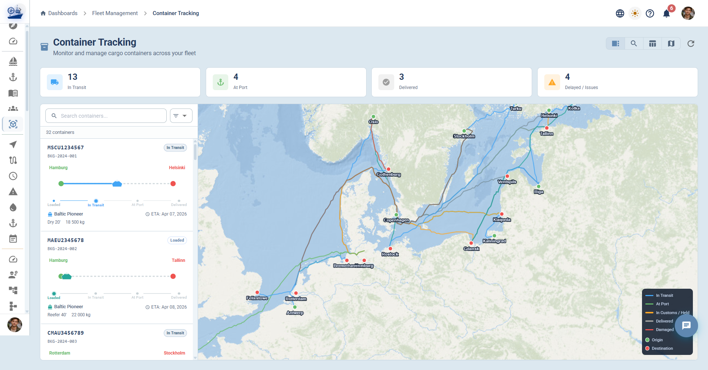
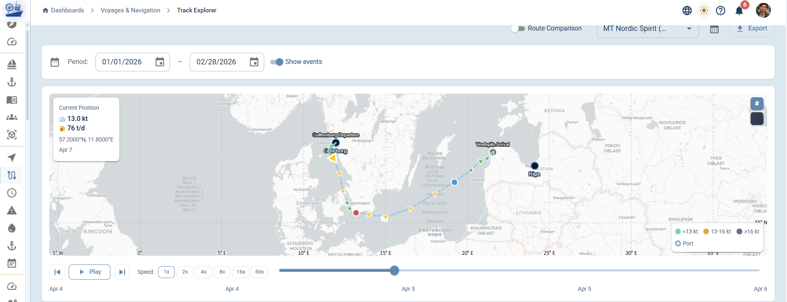

# geotrack - Real-Time Geospatial Visualization Toolkit (deck.gl)

TypeScript layers for deck.gl + MapLibre GL: vessel trails with adaptive smoothing, great-circle routes, wind/current arrow fields, dead reckoning, EWMA filtering.



## Features

- **VesselTrailLayer** - GPS trail rendering with Chaikin / Catmull-Rom smoothing, speed/fuel/status color modes, zoom-adaptive detail, gap detection, stern-bridging, and configurable `maxPoints` truncation
- **GreatCircleLayer** - Orthodrome routes via Turf.js with rhumb-line comparison, waypoint markers, and distance labels
- **OceanCurrentsLayer** - Vector arrow fields and streamline tracing for ocean currents and wind; speed-based color gradient with seedable PRNG for deterministic rendering
- **Route validation** - Simplified global land polygon set with point-in-polygon checks and adaptive segment crossing detection; injectable polygon configuration
- **Dead reckoning** - Smooth between-tick vessel position prediction using flat-Earth approximation
- **EWMA smoothing** - Stateful exponentially weighted moving average filter for sensor streams
- **Kalman filter** - 1D GPS coordinate smoothing per axis
- **Douglas-Peucker simplification** - Polyline compression for dense trail data




## Architecture

**Data flow:**

1. Caller provides `Map<vesselId, VesselRoute>` + `VesselPosition[]` to `createVesselTrailLayers`.
2. Points are deduplicated by minimum distance, trimmed to `maxPoints` (keeping latest), and optionally filtered by time range (sorted automatically if needed).
3. Each segment is smoothed with Chaikin (dense) or Catmull-Rom (sparse) at zoom-adaptive iteration count.
4. The output is a deck.gl `PathLayer` array ready for direct composition in a `DeckGL` or `MapboxOverlay`.

## Tech Stack

| | |
|---|---|
| Language | TypeScript 5.4+ |
| Rendering | deck.gl 9.x (PathLayer, ScatterplotLayer, LineLayer, TextLayer, PathStyleExtension) |
| Map base | MapLibre GL >= 4.0 |
| Geodesy | @turf/* 7.x (great-circle, bearing, booleanPointInPolygon) |
| Build | Vite 5.x library mode + vite-plugin-dts |
| Tests | Vitest |

## Install

```bash
npm install @itiana/geotrack
```

Peer dependencies (install in your project):

```bash
npm install @deck.gl/core @deck.gl/layers maplibre-gl react
```

## Build

```bash
npm run build       # outputs ESM + CJS + .d.ts to dist/
npm run test        # run all tests with vitest
npm run typecheck   # tsc --noEmit
```

## Project Structure

```
src/
├── index.ts                          # Re-exports all public APIs
├── types/
│   └── index.ts                      # VesselPosition, VesselRoute, RoutePoint, ColorMode, TrailMode
├── layers/
│   ├── index.ts                      # Layer exports
│   ├── colorUtils.ts                 # getVesselColor, getSpeedColor, getFuelColor
│   ├── VesselTrailLayer.ts           # createVesselTrailLayers, MAX_TRAIL_POINTS
│   ├── GreatCircleLayer.ts           # createGreatCircleLayers, createComparisonLayers
│   └── OceanCurrentsLayer.ts         # createOceanCurrentsLayers, createWindLayers
└── utils/
    ├── index.ts                      # Utility exports
    ├── geoUtils.ts                   # haversineKm/m, calculateBearing, isCourseAnomaly,
    │                                 # douglasPeucker, SimpleKalmanFilter, smoothTrailKalman,
    │                                 # interpolateGreatCircle
    ├── deadReckoning.ts              # predictPosition, predictPositionClamped, lerpHeading
    ├── ewma.ts                       # ewmaSmooth, createEwmaFilter
    └── routeValidation.ts            # validateRoute, doesSegmentCrossLand, isPointOnLand,
                                      # updateLandPolygons, LandPolygon

__tests__/
├── geoUtils.test.ts
├── deadReckoning.test.ts
├── ewma.test.ts
├── colorUtils.test.ts
├── routeValidation.test.ts
└── vesselTrail.test.ts
```

## Usage Examples

### Vessel trails

```typescript
import { createVesselTrailLayers } from '@itiana/geotrack';

const layers = createVesselTrailLayers({
  routes,           // Map<vesselId, VesselRoute>
  vessels,          // VesselPosition[]
  colorMode: 'SPEED',
  trailMode: 'ACTUAL',
  zoom: mapZoom,
  isDark: true,
  maxPoints: 500,   // keep latest N points per vessel
});
```

### Great-circle routes with rhumb comparison

```typescript
import { createGreatCircleLayers, createComparisonLayers } from '@itiana/geotrack';

const gcLayers = createGreatCircleLayers({
  routes: [{ id: 'r1', from: [0, 51.5], to: [139.7, 35.7], name: 'London-Tokyo' }],
  showDistance: true,
});

const comparisonLayers = createComparisonLayers({
  id: 'london-tokyo',
  from: [0, 51.5],
  to: [139.7, 35.7],
  showComparison: true,
});
```

### Dead reckoning

```typescript
import { predictPositionClamped } from '@itiana/geotrack';

const [lon, lat] = predictPositionClamped(
  vessel.longitude, vessel.latitude,
  vessel.speed, vessel.heading,
  Date.now() - lastFixTimestamp,
);
```

### EWMA filter

```typescript
import { createEwmaFilter } from '@itiana/geotrack';

const speedFilter = createEwmaFilter(0.3);
const smoothedSpeed = speedFilter.next(rawSpeedKnots);
```

### Route validation

```typescript
import { validateRoute, updateLandPolygons } from '@itiana/geotrack';
import type { LandPolygon } from '@itiana/geotrack';

// Optionally supply higher-resolution polygons
updateLandPolygons(customPolygons);

// Or pass polygons per call (avoids global state)
const result = validateRoute(waypoints, customPolygons);
if (!result.isValid) {
  result.errors.forEach(e => console.warn(e.message));
}
```

### Ocean currents with deterministic rendering

```typescript
import { createOceanCurrentsLayers, generateSampleCurrents } from '@itiana/geotrack';

const vectors = generateSampleCurrents(
  [[-10, 35], [30, 60]],
  15,   // density
  42,   // seed for reproducible output
);

const layers = createOceanCurrentsLayers({
  vectors,
  colorBySpeed: true,
  seed: 42,   // deterministic density filtering
});
```

## Trail Color Modes

| Mode | Description |
|---|---|
| `STATUS` | Green = normal, blue = anchored, orange = warning (fast/maintenance), red = critical (>= 25 kn), gray = offline |
| `SPEED` | Gray - blue - green - orange - red gradient by speed in knots |
| `FUEL` | Green (>= 70%) - amber (40-69%) - orange (20-39%) - red (< 20%) by fuel percent |

## Trail Modes

| Mode | Description |
|---|---|
| `ACTUAL` | GPS positions as received; no land check (avoids false positives near coasts) |
| `PLANNED` | Route waypoints with land-avoidance segment checks |
| `COMPARISON` | Side-by-side actual vs planned; land check applied to planned segments |

## Constants

| Constant | Value | Description |
|---|---|---|
| `MAX_TRAIL_POINTS` | 500 | Default maximum GPS points retained per vessel |
| `ACTUAL_GAP_THRESHOLD_KM` | 50 km | Gap above which consecutive ACTUAL points are treated as a teleport |
| `PLANNED_GAP_THRESHOLD_KM` | 200 km | Gap threshold for PLANNED segments |
| `DEAD_RECKONING_MAX_ELAPSED_MS` | 30 000 ms | Maximum extrapolation window for dead reckoning |
| `LAND_CHECK_MIN_DISTANCE_KM` | 10 km | Minimum segment length before land-crossing check fires |

## Release Status

**0.1.0** - API is stabilising but not yet frozen. Minor versions may include breaking changes until `1.0.0`.

---

## License

MIT - see [LICENSE](./LICENSE)
